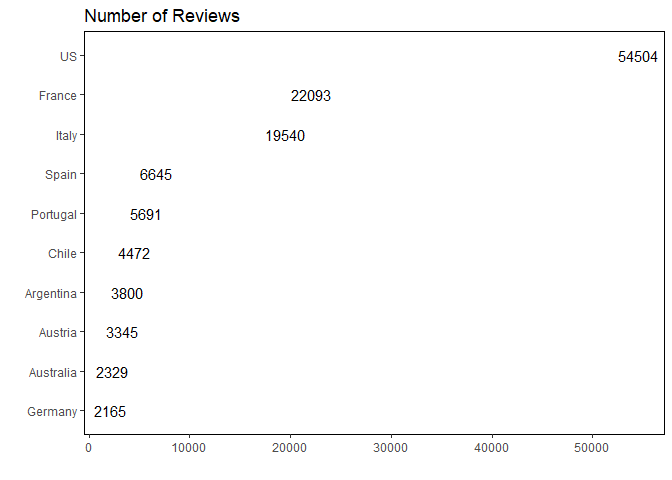
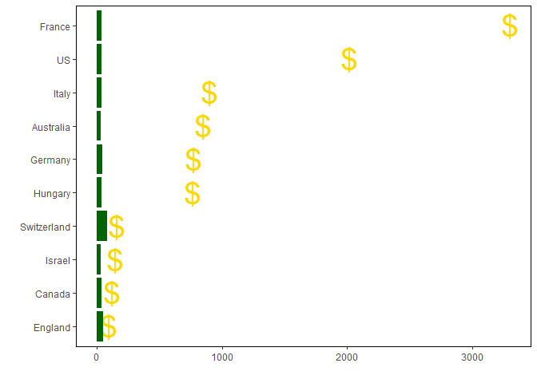
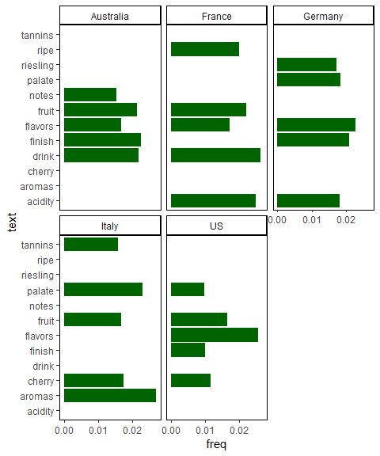
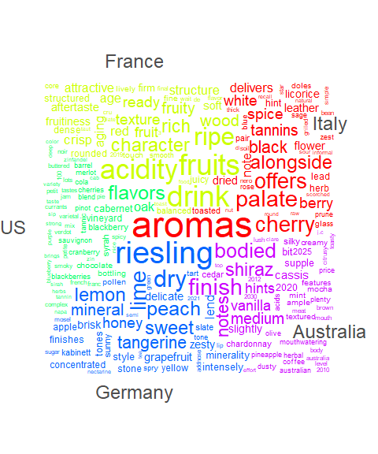
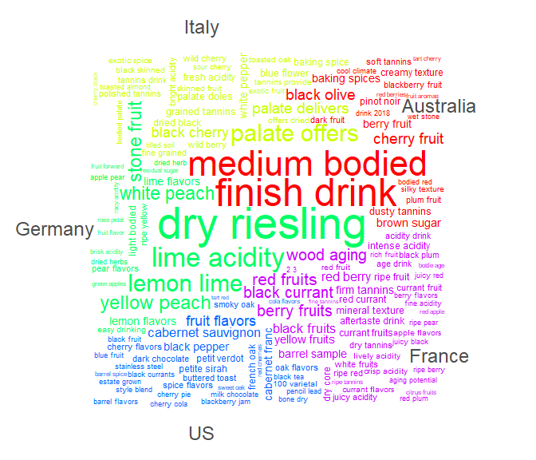

first\_tidytue
================
Frank
28/05/2019

``` r
library(tidyverse)
# wine_ratings <- readr::read_csv("https://raw.githubusercontent.com/rfordatascience/tidytuesday/master/data/2019/2019-05-28/winemag-data-130k-v2.csv")
# saveRDS(wine_ratings,file = "wine_raw.rds")
wine_ratings <- readRDS("./wine_raw.rds")
  wine_ratings %>% 
  glimpse()
```

    ## Observations: 129,971
    ## Variables: 14
    ## $ X1                    <dbl> 0, 1, 2, 3, 4, 5, 6, 7, 8, 9, 10, 11, 12...
    ## $ country               <chr> "Italy", "Portugal", "US", "US", "US", "...
    ## $ description           <chr> "Aromas include tropical fruit, broom, b...
    ## $ designation           <chr> "Vulkà Bianco", "Avidagos", NA, "Reserve...
    ## $ points                <dbl> 87, 87, 87, 87, 87, 87, 87, 87, 87, 87, ...
    ## $ price                 <dbl> NA, 15, 14, 13, 65, 15, 16, 24, 12, 27, ...
    ## $ province              <chr> "Sicily & Sardinia", "Douro", "Oregon", ...
    ## $ region_1              <chr> "Etna", NA, "Willamette Valley", "Lake M...
    ## $ region_2              <chr> NA, NA, "Willamette Valley", NA, "Willam...
    ## $ taster_name           <chr> "Kerin O’Keefe", "Roger Voss", "Paul Gre...
    ## $ taster_twitter_handle <chr> "@kerinokeefe", "@vossroger", "@paulgwin...
    ## $ title                 <chr> "Nicosia 2013 Vulkà Bianco  (Etna)", "Qu...
    ## $ variety               <chr> "White Blend", "Portuguese Red", "Pinot ...
    ## $ winery                <chr> "Nicosia", "Quinta dos Avidagos", "Rains...

# thoughts? —————————————————————

``` r
# library(leaflet) 
# country -- a map with rating size
# description text mining the reviews
dim(wine_ratings)
```

    ## [1] 129971     14

``` r
wine_theme <- function(){
  theme_classic()+
    theme(panel.border = element_rect(fill = NA))
}
```

# reviewers per country —————————————————

``` r
no.of_reviews <- wine_ratings %>% 
  filter(!is.na(country)) %>% 
  group_by(country) %>% 
  count(sort = T) %>% 
  ungroup()

no.of_reviews %>% top_n(10) %>% 
  ggplot(aes(forcats::fct_reorder(country, n), n)) +
  geom_point(size = 6, color = "transparent") +
  geom_text(aes(label = n))+
  coord_flip() +
  wine_theme() +
  labs(x = "", y = "") +
  ggtitle("Number of Reviews")
```

    ## Selecting by n

<!-- -->

``` r
# max and mean price ------------------------------------------------------

price <- wine_ratings %>% 
  filter(!is.na(country)) %>% 
  group_by(country) %>% filter(!is.na(price)) %>% 
  summarise(n = max(price, na.rm = T),
            mean = mean(price, na.rm = T))
price %>% top_n(10) %>% 
  # filter(country == "Egypt")
  ggplot(aes(forcats::fct_reorder(country, n))) +
  geom_point(aes(y = n), shape = "$", color = "gold", size = 10)+
  geom_col(aes(y = mean), fill = "darkgreen")+
  coord_flip()+
  wine_theme()+
  labs(x = "", y = "")
```

    ## Selecting by mean

<!-- -->

``` r
library(tidytext)
top_5 <- price %>% 
  arrange(desc(n),desc(mean)) %>% 
  top_n(10) %>% 
  inner_join(no.of_reviews %>% 
               top_n(10), by = "country")

tokenized <- wine_ratings %>% 
  filter(!is.na(country), !is.na(description)) %>% 
  select(country, description, points, price) %>% 
  unnest_tokens(input = description, output = text)

freq <- tokenized %>% 
  filter(!text %in% c(stop_words$word,"wine"),
         country %in% top_5$country) %>% 
  group_by(country) %>% 
  count(text, sort = T) %>% 
  mutate(total = sum(n),
         freq = n/total) %>%
  arrange(desc(freq)) 
freq %>% top_n(5) %>% 
  mutate(text = fct_reorder(text, freq)) %>%
  ggplot(aes(text, freq))+
  geom_col(fill = "darkgreen") +
  coord_flip() +
  wine_theme() +
  facet_wrap( ~ country)
```

<!-- -->

``` r
dfm <- cast_dfm(freq,document = country,term = text,value = n)

library(quanteda)

textplot_wordcloud(dfm,comparison = T, color = rainbow(5))
```

<!-- --> \# ngram 2
—————————————————————–

``` r
tokenized <- wine_ratings %>% 
  filter(!is.na(country), !is.na(description)) %>% 
  select(country, description, points, price) %>% 
  unnest_tokens(input = description, output = text,token = "ngrams" , n = 2)

freq <- tokenized %>% 
  separate(text, into = c("first","second"),sep = " ") %>% 
  filter(!first %in% c(stop_words$word,"wine"),
         !second %in% c(stop_words$word,"wine")) %>% 
  unite(text, first, second,sep = " ")
bigrams <- freq %>% 
  filter(country %in% top_5$country) %>% 
  group_by(country) %>% 
  count(text, sort = T) %>% 
  mutate(total = sum(n),
         freq = n/total) %>%
  arrange(desc(freq)) 
dfm <- cast_dfm(bigrams,document = country,term = text,value = n)
set.seed(42)
textplot_wordcloud(dfm,comparison = T, min_count = 300,color = rainbow(5),labelsize = 1.5)
```

<!-- -->
